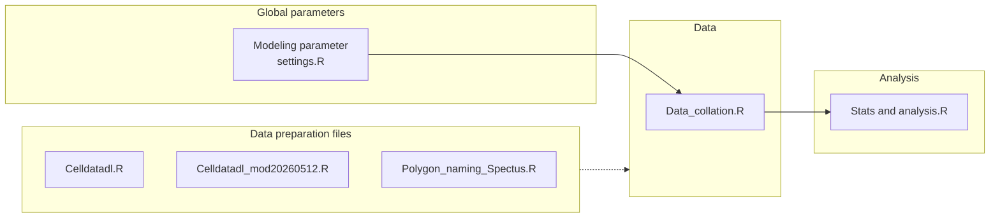

# Description

Scripts to conduct random utility modeling using mobile device data in Miami, FL parks.

## Usage
- All data is imported programatically in the script `Data_collation.R` from two zip files hosted on google drive. This script deletes and rewrites the data folder in this repository, so do not leave anything in there you want. Instead, if it is meant as a data input, put it in the zip file on google drive. 
- The structure of this repository is as follows: `Modeling parameter settings.R` includes all global settings for modeling and is sourced in `Data_collation.R` where all raw data is imported and collated for analysis. All analysis scripts build off of `Data_collation.R` for consistent baseline data.

## Notes
[This document](https://docs.google.com/document/d/1oytwVALoedOB2FD--oDYmal8PGDaC5V4LyLlTQnXLRI/edit?usp=sharing) is a working document reference for methods and input data quality
